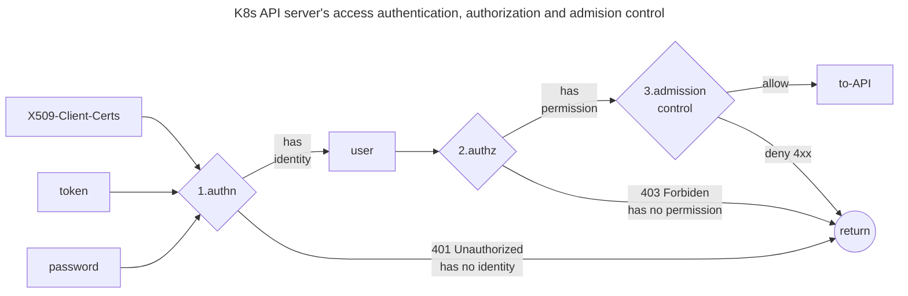
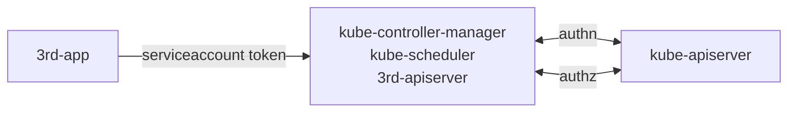
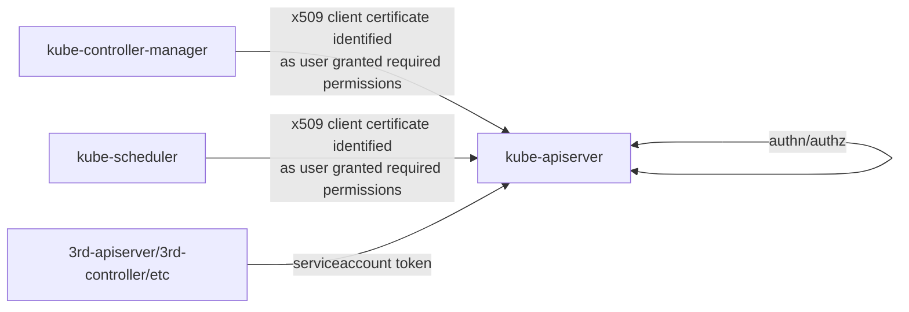
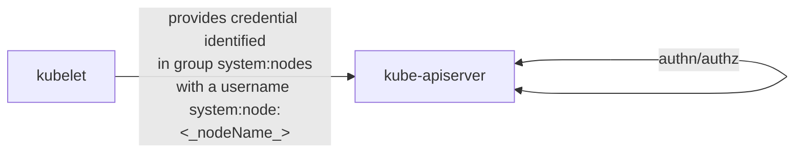
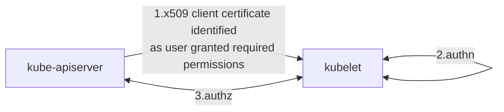
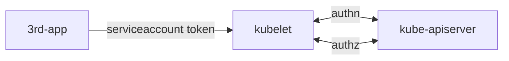
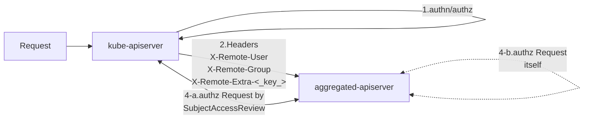

## kube-apiserver authn and authz



Once TLS is established, the HTTP request moves to the Authentication (authn) step.

Credentials, such as client certificates, tokens, and passwords, are used in this process. As described in [K8s Doc: Authenticating], Kubernetes supports severals authentication plugins. In most cases, the kube-apiserver is configured to authenticate API requests through x509 client certificates, bootstrap tokens and service account tokens. Other strategies, like static token file (mostly used in testing), OpenID Connect tokens, authenticating proxy, and webhook are also configurable.

**If the request cannot be authenticated, it is rejected with HTTP status code 401.**
**Otherwise, the request is authenticated as coming from a specific user.**
In the context of X509 client certificates, which are primarily covered in this post, the common name of the subject is used as the username for the request. The certificate's organization fields are used to determine the user's group memberships.

Following authentication, the HTTP request moves to the Authorization (authz) step. This involves the user of the requester, the requested action, and the object affected by the action. The user's permissions are interpreted by server's authorizers.

User's permissions can be granted by multiple polices, including role-based access control (RBAC), Node Authorization, Webhook and attribute-based access control (ABAC).

If an existing policy states that the user has permissions to complete the requested action, the request is authorized and proceeds to admission control step. Otherwise, the request is denied (HTTP status code 403).

Admission control is not covered by this post. For more details, please refer to my post [K8s API Admission Control and Policy].

## authn and authz in other components

Other components, such as kubelet, third-party apiservers, can delegate authentication to the kube-apiserver using the webhook authentication strategy with [authentication.k8s.io/TokenReview].
They can also delegate authorization to the kube-apiserver using the webhook authorization mode with [authorization.k8s.io/SubjectAccessReview].

Components can implement additional authentication strategies as needed. 
For instance, a custom apiserver's authentication can support using the kube-apiserver as a front-proxy, 
and the kubelet server's authentication support x509 client certificates.

Generally, the kube-apiserver acts as the authority control center of the cluster. 
It grants permissions to all users through RBAC and Node Authorization. 
In some cases, ABAC and webhook may also be used. 
Other components should always delegate authorization to the kube-apiserver.

Let's take the controller manager, scheduler and third-party apiserver as generic examples
- `authentication-kubeconfig` configures the crenditial used to send an [authentication.k8s.io/TokenReview] to kube-apiserver for authentication
- `authorization-kubeconfig` configures the crenditial used to send an [authorization.k8s.io/SubjectAccessReview] to kube-apiserver for authorization

```shell
# common options in kube-controller-manager, kube-scheduler and 3rd apiserver
--authentication-kubeconfig string
    kubeconfig file pointing at the 'core' kubernetes server with enough rights to create
    tokenreviews.authentication.k8s.io. This is optional. 
    If empty, all token requests are considered to be anonymous and no client CA is looked up in the cluster.
--authorization-kubeconfig string
    kubeconfig file pointing at the 'core' kubernetes server with enough rights to create
    subjectaccessreviews.authorization.k8s.io. This is optional. 
    If empty, all requests not skipped by authorization are forbidden.
```



## components reqeuests kube-apisever 

The `client-ca-file` option in kube-apiserver is used to set up the Certificate Authority (CA) for client certificates.
This CA is responsible for validating client certificates from components such as kubelet, kube-controller-manager, and others. 

Typically, this CA is referred to as the `cluster CA`.

The server certificate for kube-apiserver is configured using the `tls-cert-file` and `tls-private-key-file` options.

Components that send requests to kube-apiserver can do the following:
- verify the server certificate by its pulic CA (as specified in kubeconfig's clusters field)
- authenticate to the kube-apiserver using a client certificate (as specified in kubeconfig's users field)

```
apiVersion: v1
clusters:
- cluster:
    certificate-authority: path/to/apiserver/ca.crt
    server: https://myapiserver.zeng.dev:6443
  name: my-cluster
kind: Config
users:
- name: foo
  user:
    client-certificate: path/to/my/client/cert 
    client-key: path/to/my/client/key
```

The CA of kube-apiserver's server certificate and the CA of component's client certificates don't need to be the same.

Generally they're the same.



The kube-apiserver performs authentication and authorization on the credentials of component applications. This process requires:
- The credentials to identify them as a specific user in the cluster (typically a special user in the x509 client certificate or a service account user in the cluster)
- The authenticated user to have permission to perform actions on cluster resources

There are some examples
- The kube-scheduler requests the kube-apiserver with an x509 client certificate's subject common name as  `system:kube-schedule`
- The kube-controller-manager requests the kube-apiserver with an x509 client certificate's subject common name as `system:kube-controller-manager`
- The kube-proxy requests the kube-apiserver with an x509 client certificate's subject common name as `system:kube-proxy`
- Kubectl, with an admin config, requests the kube-apiserver with an x509 client certificate's subject organization as `system:masters`
- A third-party apiserver requests the kube-apiserver with a service account token that has been granted permissions

Well-known user and group names can be found at [k8s.io/apiserver/pkg/authentication/user/user.go](https://github.com/kubernetes/apiserver/blob/master/pkg/authentication/user/user.go#L70-L85)

## kubelet requests kube-apiserver



The kube-apiserver authenticates requests from the kubelet. Any credential supported by the kube-apiserver is acceptable.

Kubernetes uses a [special-purpose authorization mode](https://kubernetes.io/docs/reference/access-authn-authz/node/) called Node Authorizer, that specifically authorizes API requests made by kubelets.

To be authorized by the Node Authorizer, kubelets must use a credential that identifies them as part of the `system:nodes` group, with a username of `system:node:<nodeName>`.

Typically, the kubelet's credential is an x509 client certificate issued by the cluster CA.
The certificate's subject organization is `system:nodes`, and its subject common name is `system:node:<nodeName>`.

## kube-apiserver requests kubelet



The kube-apiserver is configured with the following options:

```shell
--kubelet-certificate-authority string      Path to a cert file for the certificate authority.
--kubelet-client-certificate string         Path to a client cert file for TLS.
--kubelet-client-key string                 Path to a client key file for TLS.
```

The kubelet configures its options in a config file:

```yaml
apiVersion: kubelet.config.k8s.io/v1beta1
kind: KubeletConfiguration
authentication:
  anonymous:
    enabled: false
  webhook:          # delegate authn to kube-apiserver. 
    enabled: true   # for example, Prometheus provides serviceaccount token when scrape metrics
  x509:
    clientCAFile: /etc/kubernetes/pki/ca.crt
authorization:
  mode: Webhook
```

The kubelet and kube-apiserver use mutual TLS (mTLS) to verify each other:
- Kubelet verify kube-apiserver's client certificate is issued by the required CA (`authentication.x509.clientCAFile`).
- Kube-apiserver verify kubelet's server certificate is issued by the required CA (`kubelet-certificate-authority`).

Typically, these two CAs are the same. Both of them are the cluster CA.

The kubelet authenticates to the kube-apiserver, assuming its user identity is provided in the client certificate (with the subject organization as the group and the common name as the username).

For authorization, the kubelet sends an [authorization.k8s.io/SubjectAccessReview] to the kube-apiserver. 
And yes, kube-apiserver check its own permissions by looking up the policy bound to the user in its client certificate.

## kubelet x509 cert distribution

Kubelet's x509 server certificates and client certificates can be issued by the controller manager using CSR (see [K8s Doc: Certificates and Certificate Signing Requests] and [K8s Doc: Kubelet TLS bootstrapping]). They're issued by the controller manager.

👻 That's why the controller manager have start options below

    --cluster-signing-cert-file=/etc/kubernetes/pki/ca.crt 
    --cluster-signing-key-file=/etc/kubernetes/pki/ca.key

## 3rd application requests kubelet



Third-party application can visit kubelet HTTPS server with service account token. 
In this case kubelet sends [authentication.k8s.io/TokenReview] to kube-apiserver for authn, and [authorization.k8s.io/SubjectAccessReview] for authz.

## kube-apiserver as a front proxy (kube-aggregation)



The kube-apiserver provides several aggregation authentication options:
- `proxy-client-cert-file` and `proxy-client-key-file` configure the credentials used when acting as a client/aggregator/front-proxy
- `requestheader-client-ca-file` and `requestheader-allowed-names` configure the CA and list of client certificate common names that the aggregated apiserver uses to verify the aggregator server (usually kube-apiserver). These are synced to the ConfigMap extension-apiserver-authentication in the kube-system namespace when the kube-apiserver starts up. 

The aggregated 3rd party apiservers can read authentication configurations from the `kube-system/extension-apiserver-authentication` ConfigMap.

```shell
--proxy-client-cert-file string             ---------------------------------------+
  x509 cert used to prove the identity when work as aggregator(front-proxy)        |-> used by kube-aggregator (
--proxy-client-key-file string              ---------------------------------------+    module in kube-apiserver)
  x509 private key used to prove the identity when work as aggregator(front-proxy)           


--requestheader-client-ca-file string       --------------------------------+---+
  CA bundle used to verify client certificates on incoming requests when    +---|--> used to verify aggregator 
    work as aggregated-apiserver                                            |   |     server's client certificate
--requestheader-allowed-names strings       --------------------------------|   |   
  List of client certificate common names allowed to work as aggregator         +-> used by aggregated apiserver
--requestheader-username-headers string     ---------------------------------+  |    configured in kube-apiserver   
  List of request headers to inspect for usernames. X-Remote-User is common  |  |    synced to ConfigMap            
--requestheader-group-headers               ---------------------------------|  |      
  List of request headers to inspect for groups. X-Remote-Group is suggested +--|--> HTTP header key used to
--requestheader-extra-headers-prefix        ---------------------------------+  |     read user info from
  List of request header prefixes to inspect. X-Remote-Extra- is suggested -----+         
```

Firstly The aggregated-apiserver use the CA (configured by `requestheader-client-ca-file`) and `requestheader-allowed-names` to verify that the incoming request is from a valid kube-aggregator.

Then, the aggregated-apiserver authenticates the proxied request by mapping the headers `X-Remote-User`, `X-Remote-Group` and `X-Remote-Extra-<key>` to the user.

Finally, the aggregated-apiserver authorizes the proxied request:
- by delegating it to the kube-apiserver if it doesn't implement authority control (as many 3rd party apiservers do)
- by authorizing it itself. The aggregated-apiserver can also be an apiserver that works as an authority.

In practice, any component in the cluster could leverage the front-proxy authentication strategy.
The authentication configuration of kube-controller-manager or kube-scheduler has these **requestheader-** options.

## service account

For service accounts, the kube-apiserver options are:
  
    --service-account-key-file stringArray 
        PEM-encoded x509 RSA or ECDSA private or public keys, used to verify ServiceAccount tokens
    --service-account-signing-key-file string
        current private key of the service account token issuer
    --service-account-issuer stringArray 
        Identifier of the service account token issuer
        The issuer will assert this identifier in "iss" claim of issued tokens

A client sends a `POST /api/v1/namespaces/{ns}/serviceaccounts/{sa}/token`request. The API server generates a service account token and signs the token using the private key of the service account token issuer. A TokenRequest containing the token is returned.

As API requests come in with the service account token, the kube-apiserver verifies the token in authentication with the public key of the service account token issuer.

Service account tokens issued by the API server are short-lived Kubernetes tokens. They are never persisted and can only be revoked by deleting their service account.

kube-controller-manager options

    --root-ca-file  root certificate authority will be included in service account's token secret.
    --service-account-private-key-file

The controller manager generate service account token and sign the token using the private key of the service account token issuer. 

The token's issuer is `kubernetes/serviceaccount`. The `root-ca-file` generally is the cluster CA.

The token and root CA both included in service account's token secret.

After v1.25, Kubernetes won't auto generate token secret for service account. 

Service account tokens issued by the controller manager are so-called long-lived Kubernetes tokens. It can be revoked by delete their secret object.

Example of service account token issued by kube-apiserver

```json
{
  "aud": [
    "https://kubernetes.default.svc.cluster.local"
  ],
  "exp": 1720539011,
  "iat": 1689003011,
  "iss": "https://kubernetes.default.svc.cluster.local",
  "kubernetes.io": {
    "namespace": "default",
    "serviceaccount": {
      "name": "default",
      "uid": "fcd19abf-938f-4485-9bf5-701d04137ffc"
    }
  },
  "nbf": 1689003011,
  "sub": "system:serviceaccount:default:default"
}
```

## mTLS between etcd and kube-apiserver

There are kube-apiserver command line arguments about secure communication with etcd

    --etcd-cafile=/etc/kubernetes/pki/etcd/ca.crt 
    --etcd-certfile=/etc/kubernetes/pki/apiserver-etcd-client.crt 
    --etcd-keyfile=/etc/kubernetes/pki/apiserver-etcd-client.key

These etcd command line arguments about secure communication with its client

    --trusted-ca-file=/etc/kubernetes/pki/etcd/ca.crt
    --cert-file=/etc/kubernetes/pki/etcd/server.crt
    --key-file=/etc/kubernetes/pki/etcd/server.key

The API server requests etcd with client x509 certificate and key, the etcd server validates the crenditial with `trusted-ca-file`.
Conversely, the API server validates etcd's server x509 certificate and key with `etcd-cafile`.

Note: `etcd-cafile` used by kube-apiserver and `trusted-ca-file` used by etcd server don't need to be the same.
`
## Summarize

Here are the summary of the API server's command line arguments to do with certificates or keys 

```shell
--cert-dir string                 -------------+
--tls-cert-file string                         |
--tls-private-key-file string                  +--> serve securely on HTTPS
--tls-sni-cert-key namedCertKey                |
  (SNI certs, alternative to tls-cert) --------+

--client-ca-file string    --------------------> x509 CA authenticate client requests

--etcd-certfile string     --------------------+                   
--etcd-keyfile string                          +--> mTLS with etcd server
--etcd-cafile string       --------------------+

--kubelet-certificate-authority string --------+     
--kubelet-client-certificate string            +--> mTLS with kubelet
--kubelet-client-key string            --------+
 
--proxy-client-cert-file string        --------+     
--proxy-client-key-file string                 | 
                                               |
--requestheader-client-ca-file string          +--> aggregation TLS
--requestheader-allowed-names strings          |      prove requests proxied from kube-aggregator
--requestheader-extra-headers-prefix strings   |
--requestheader-group-headers strings          |
--requestheader-username-headers strings  -----+

--service-account-key-file stringArray     ----+ 
--service-account-signing-key-file string  ----+--> service account key pair   
```

Here are the summary of the controller-manager

```shell
--cluster-signing-cert-file string   ---+--> CSR (Certificate Signing Requests) signing controller flags       
--cluster-signing-key-file string    ---+          

--root-ca-file string                ---+--> issue long-lived service account token in secret                      
--service-account-private-key-file   ---+

--client-ca-file                     ---> authn requests by x509 client cert
--requestheader-*                    ---> authn requests by front-proxy requestheaders
--authentication-kubeconfig          ---> delegate authn to kube-apiserver
--authorization-kubeconfig           ---> delegate authz to kube-apiserver
```

The scheduler's arguments to do with certificates are like the controller manager, but only about authn and authz.

Here are the summary of the kubelet

```shell
apiVersion: kubelet.config.k8s.io/v1beta1    
kind: KubeletConfiguration
authentication:                             --------------------+
  anonymous:                                                    |
    enabled: false                                              |
  webhook:                                                      |
    enabled: true                                               + authn/authz strategies
  x509:                                                         |
    clientCAFile: /etc/kubernetes/pki/ca.crt # --client-ca-file |
authorization:                                                  |
  mode: Webhook                                                 |
rotateCertificates: true                    --------------------+
---
--bootstrap-kubeconfig             --------+
--cert-dir  # default /var/lib/kubelet/pki +--> server/client x509 certs dynamic issue from CSR          
--tls-cert-file                            |
--tls-private-key-file             --------+
```

## Furthur Reading
1. [K8s Doc: Controlling Access to the Kubernetes API]
2. [Julia Evans: How Kubernetes certificate authorities work]
3. [Kubernetes The Hard Way]
4. [K8s Doc: PKI certificates and requirements]
5. [K8s Doc: Certificates and Certificate Signing Requests]
6. [K8s Doc: Kubelet TLS bootstrapping]
7. [K8s Doc: Communication between Nodes and the Control Plane]
8. [K8s Doc: Authenticating]
9. [User and workload identities in Kubernetes](https://learnk8s.io/authentication-kubernetes)
10. [K8s Doc: Authorization Overview]
11. [K8s Doc: Kubelet authentication/authorization]
12. [K8s Doc: Kubernetes API Aggregation Layer]
13. [搞懂 K8s apiserver aggregation]
14. [What GKE users need to know about Kubernetes' new service account tokens](https://cloud.google.com/blog/products/containers-kubernetes/kubernetes-bound-service-account-tokens)

[K8s API Admission Control and Policy]: ../2023-k8s-api-admission
[搞懂 K8s apiserver aggregation]: ../2023-k8s-apiserver-aggregation-internals

[K8s Doc: Controlling Access to the Kubernetes API]: https://kubernetes.io/docs/concepts/security/controlling-access/
[K8s Doc: Communication between Nodes and the Control Plane]: https://kubernetes.io/docs/concepts/architecture/control-plane-node-communication/
[K8s Doc: Authenticating]: https://kubernetes.io/docs/reference/access-authn-authz/authentication/
[K8s Doc: Authorization Overview]: https://kubernetes.io/docs/reference/access-authn-authz/authorization/
[K8s Doc: Kubelet authentication/authorization]: https://kubernetes.io/docs/reference/access-authn-authz/kubelet-authn-authz/
[K8s Doc: Kubernetes API Aggregation Layer]: https://kubernetes.io/docs/concepts/extend-kubernetes/api-extension/apiserver-aggregation/
[K8s Doc: Certificates and Certificate Signing Requests]: (https://kubernetes.io/docs/reference/access-authn-authz/certificate-signing-requests/)
[K8s Doc: Kubelet TLS bootstrapping]: https://kubernetes.io/docs/reference/access-authn-authz/kubelet-tls-bootstrapping/
[K8s Doc: PKI certificates and requirements]: https://kubernetes.io/docs/setup/best-practices/certificates/

[authentication.k8s.io/TokenReview]: https://github.com/kubernetes/api/blob/5d126b39754e30ad9a9206307e95f569ffe887ec/authentication/v1/types.go#L52
[authorization.k8s.io/SubjectAccessReview]: https://github.com/kubernetes/api/blob/5d126b39754e30ad9a9206307e95f569ffe887ec/authorization/v1/types.go#L31

[Kubernetes The Hard Way]: https://github.com/kelseyhightower/kubernetes-the-hard-way/blob/master/docs/04-certificate-authority.md

[Julia Evans: How Kubernetes certificate authorities work]: https://jvns.ca/blog/2017/08/05/how-kubernetes-certificates-work/