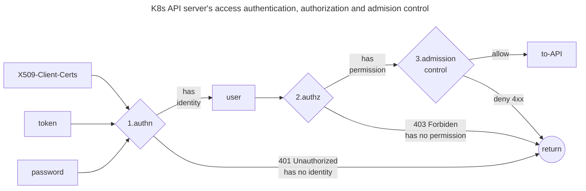
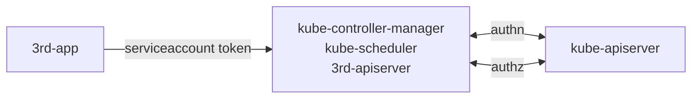
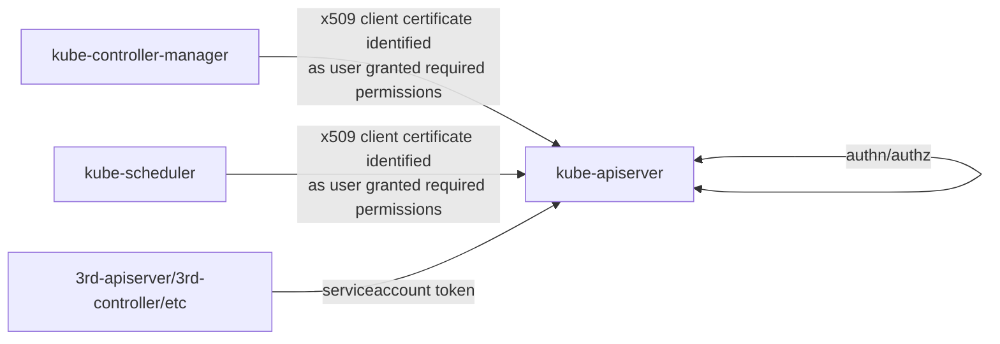
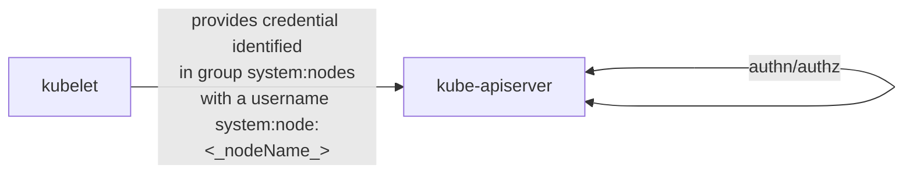
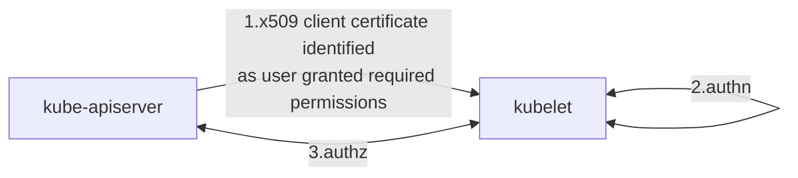
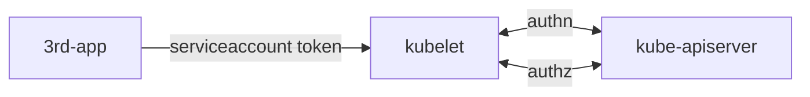
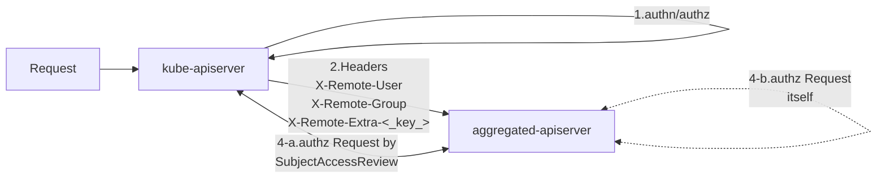

## kube-apiserver authn and authz



Once TLS is established, the HTTP request moves to the Authentication (authn) step.

Client certificates, tokens and passwords, will be used as credential. As described in [K8s Doc: Authenticating], Kubernetes supports severals authentication plugins. In most cases the kube-apiserver is configured to authenticate API requests through x509 client certificates, bootstrap tokens and service account tokens. Other strategies like static token file (mostly in testing), OpenID Connect tokens, authenticating proxy, and webhook are also configurable.

**If the request cannot be authenticated, it is rejected with HTTP status code 401.**
**Otherwise, the request is authenticated as coming from a specific user.**
In X509 client certificate covered most in this post, the common name of the subject is used as the user name for the request. The certificate's organization fields are used as a user's group memberships.

Then the HTTP request moves to the Authorization (authz) step, with the user of the requester, the requested action, and the object affected by the action. The user's permissions are interpreted by authorizers in server.

User's permissions can be granted by multiple polices, including role-based access control (RBAC), Node Authorization, Webhook and attribute-based access control (ABAC).

If an existing policy declares that the user has permissions to complete the requested action. The request is authorized and moves to admission control step. Otherwise, the request is denied (HTTP status code 403).

Admission control won't covered by this post. You can refer to my post [K8s API Admission Control and Policy] for more details.

## authn and authz in other components

Other components, such as kubelet, 3rd apiserver,
can use authn strategy webhook to delegate authn to kube-apiserver with [authentication.k8s.io/TokenReview], 
can use authz mode webhook to delegate authz to kube-apiserver with [authorization.k8s.io/SubjectAccessReview].

Components can add more authn strategies as they want. For example,
Cutsom apiserver's authn supports using kube-apiserver as a front-proxy.
Kubelet server's authn supports x509 client certificate.

Generally, kube-apiserver work as authority control center of the cluster. 
It grants permissions to all users by RBAC and Node Authorization. In some cases ABAC and webhook maybe used.
Other Components should always delegate authz to kube-apiserver.

Let's take kube-controller-manager, kube-scheduler and 3rd apiserver as generic examples
- `authentication-kubeconfig` configures the crenditial used to send a [authentication.k8s.io/TokenReview] to kube-apiserver for authn
- `authorization-kubeconfig` configures the crenditial used to send a [authorization.k8s.io/SubjectAccessReview] to kube-apiserver for authz

```shell
# common options in kube-controller-manager, kube-scheduler and 3rd apiserver
--authentication-kubeconfig string
    kubeconfig file pointing at the 'core' kubernetes server with enough rights to create
    tokenreviews.authentication.k8s.io. This is optional. 
    If empty, all token requests are considered to be anonymous and no client CA is looked up in the cluster.
--authorization-kubeconfig string
    kubeconfig file pointing at the 'core' kubernetes server with enough rights to create
    subjectaccessreviews.authorization.k8s.io. This is optional. 
    If empty, all requests not skipped by authorization are forbidden.
```



## components reqeuests kube-apisever 

Kube-apiserver's option `client-ca-file` configures the Certificate Authority (CA) of client certificates. 
The CA is used to validate client certificates of kubelet, kube-controller-manager, etc.

Normally this CA is called `cluster CA`.

The server certificate of kube-apiserver is configured by options `tls-cert-file` and `tls-private-key-file`.

Componnet sending requests to kube-apiserver can 
- verify the server certificate by its pulic CA (as specified in kubeconfig's clusters field)
- authenticate to the kube-apiserver with client certificate (as specified in kubeconfig's users field)

```
apiVersion: v1
clusters:
- cluster:
    certificate-authority: path/to/apiserver/ca.crt
    server: https://myapiserver.zeng.dev:6443
  name: my-cluster
kind: Config
users:
- name: foo
  user:
    client-certificate: path/to/my/client/cert 
    client-key: path/to/my/client/key
```

The CA of kube-apiserver's server certificate and the CA of component's client certificates don't need to be the same.

Generally they're the same one.



Kube-apiserver do authn/authz to component application's crenditial, requires
- the crenditial identifies them as being some user in cluster (normally specialy user in x509 client certificate and service account user in cluster)
- the authenticated user have perssimision to make action on cluster resources

There are some examples
- kube-schduler requests kube-apiserver with an x509 client certificate's subject common name as `system:kube-schedule`
- kube-controller-manager requests kube-apiserver with an x509 client certificate's subject common name as `system:kube-controller-manager`
- kube-controller-manager requests kube-apiserver with an x509 client certificate's subject common name as `system:kube-proxy`
- kubectl with an admin config requests kube-apiserver with an x509 client certificate's subject orignazation as `system:masters`
- 3rd apiserver requests kube-apiserver with service account token  that has been granted permissions

Well-known user and group names can be found at [k8s.io/apiserver/pkg/authentication/user/user.go](https://github.com/kubernetes/apiserver/blob/master/pkg/authentication/user/user.go#L70-L85)

## kubelet requests kube-apiserver



kube-apiserver authn requests from kubelet. Any credential supported by kube-apiserver is OK. 

Kubernetes uses a [special-purpose authorization mode](https://kubernetes.io/docs/reference/access-authn-authz/node/) called Node Authorizer, that specifically authorizes API requests made by Kubelets.

In order to be authorized by the Node Authorizer, Kubelet must use a credential that identifies them as being in the `system:nodes` group, with a username of `system:node:<nodeName>`.

Generally the kubelet crenditial is a x509 client certificate issued by cluster CA.
The certificate's subject orignazation is `system:nodes`, subject common name is `system:node:<nodeName>`.

## kube-apiserver requests kubelet



kube-apiserver configure its options as blows

```shell
--kubelet-certificate-authority string      Path to a cert file for the certificate authority.
--kubelet-client-certificate string         Path to a client cert file for TLS.
--kubelet-client-key string                 Path to a client key file for TLS.
```
kubelet configure its options in config file.

```yaml
apiVersion: kubelet.config.k8s.io/v1beta1
authentication:
  anonymous:
    enabled: false
  webhook:          # delegate authn to kube-apiserver. 
    cacheTTL: 0s    # for example, Prometheus provides serviceaccount token when scrape metrics
    enabled: true
  x509:
    clientCAFile: /etc/kubernetes/pki/ca.crt
authorization:
  mode: Webhook
  webhook:
    cacheAuthorizedTTL: 0s
    cacheUnauthorizedTTL: 0s
```

Kubelet and Kube-apiserver uses mTLS to verify each other
- Kubelet verify kube-apiserver's client certificate is issued by required CA (`authentication.x509.clientCAFile`).
- Kube-apiserver verify kubelet's server certificate is issued by required CA (`kubelet-certificate-authority`).

Generally this two CA are cluster CA.

Kubelet do authn to kube-apiserver, assume its user identity is provided in client certificate (subject orignazation as group and common name as username).

For authz, kubelet sends an [authorization.k8s.io/SubjectAccessReview] to kube-apiserver. 
And yes, kube-apiserver check itself's permission by looking up the policy binding to the user in its client certificate.

## 3rd application requests kubelet



Third-party application can visit kubelet HTTPS server with service account token. 
In this case kubelet sends [authentication.k8s.io/TokenReview] to kube-apiserver for authn, and [authorization.k8s.io/SubjectAccessReview] for authz.

## kube-apiserver as a front proxy (kube-aggregation)



There're aggregation authentication options in kube-apiserver
- `proxy-client-cert-file` and `proxy-client-key-file` configures the crenditials to use when work as client/aggregator/front-proxy
- `requestheader-client-ca-file` and `requestheader-allowed-names` configures the CA and  List of client certificate common names used by aggregated apiserver to verify the aggregator server (normally kube-apiserver). They're synced to ConfigMap extension-apiserver-authentication in namespace kube-system when kube-apiserver startup. 

The aggregated 3rd apiservers can read authn configurations from ConfigMap extension-apiserver-authentication. 

```shell
--proxy-client-cert-file string             ---------------------------------------+
  x509 cert used to prove the identity when work as aggregator(front-proxy)        |-> used by kube-aggregator (
--proxy-client-key-file string              ---------------------------------------+    module in kube-apiserver)
  x509 private key used to prove the identity when work as aggregator(front-proxy)           


--requestheader-client-ca-file string       --------------------------------+---+
  CA bundle used to verify client certificates on incoming requests when    +---|--> used to verify aggregator 
    work as aggregated-apiserver                                            |   |     server's client certificate
--requestheader-allowed-names strings       --------------------------------|   |   
  List of client certificate common names allowed to work as aggregator         +-> configured in kube-apiserver
--requestheader-username-headers string     ---------------------------------+  |    synced to ConfigMap   
  List of request headers to inspect for usernames. X-Remote-User is common  |  |    used by aggregated apiserver             
--requestheader-group-headers               ---------------------------------|  |      
  List of request headers to inspect for groups. X-Remote-Group is suggested +--|--> HTTP header key used to
--requestheader-extra-headers-prefix        ---------------------------------+  |     read user info from
  List of request header prefixes to inspect. X-Remote-Extra- is suggested -----+         
```

Firstly The aggregated-apiserver use CA (configured by `requestheader-client-ca-file`) and `requestheader-allowed-names` to verify the coming request is from valid kube-aggregator.

Then the aggregated-apiserver authn the proxied request by mapping Headers `X-Remote-User`, `X-Remote-Group` and `X-Remote-Extra-<key>` to user.

Lastly the aggregated-apiserver authz the proxied request 
- by delegated it to kube-apiserver if it doesn't implments authority control (as many 3rd apiserver do)
- do authz itself. The aggregated-apiserver can also be a apiserver work as authority

## service account

kube-apiserver options
  
    --service-account-key-file stringArray 
        PEM-encoded x509 RSA or ECDSA private or public keys, used to verify ServiceAccount tokens
    --service-account-signing-key-file string
        current private key of the service account token issuer
    --service-account-issuer stringArray 
        Identifier of the service account token issuer
        The issuer will assert this identifier in "iss" claim of issued tokens

client send a request `POST /api/v1/namespaces/{ns}/serviceaccounts/{sa}/token`. kube-apiserver generate token using the service account private key (and save it to etcd). A TokenRequest contains the token was returned.

kube-controller-manager options
    --root-ca-file  root certificate authority will be included in service account's token secret.
    --service-account-private-key-file

The controller manager generate service account token and sign the token using the service account private key. 

The token's issuer is `kubernetes/serviceaccount`. The `root-ca-file` generally is the cluster CA.

The token and root CA both included in service account's token secret.

After v1.25, Kubernetes won't auto generate token secret for service account.

> You can’t use a CA to check the validity of the service account key.
> 
> --[Julia Evans: How Kubernetes certificate authorities work]

##todo kube-controller requestheaders???

## Furthur Reading
1. [K8s Doc: Controlling Access to the Kubernetes API]
2. [Julia Evans: How Kubernetes certificate authorities work]
3. [Kubernetes The Hard Way]
4. [K8s Doc: Communication between Nodes and the Control Plane]
5. [K8s Doc: Authenticating]
6. [K8s Doc: Authorization Overview]
7. [K8s Doc: Kubelet authentication/authorization]
8. [K8s Doc: Kubernetes API Aggregation Layer]
9. [搞懂 K8s apiserver aggregation]
9. [What GKE users need to know about Kubernetes' new service account tokens]: https://cloud.google.com/blog/products/containers-kubernetes/kubernetes-bound-service-account-tokens

[K8s API Admission Control and Policy]: ../2023-k8s-api-admission
[搞懂 K8s apiserver aggregation]: ../2023-k8s-apiserver-aggregation-internals

[K8s Doc: Controlling Access to the Kubernetes API]: https://kubernetes.io/docs/concepts/security/controlling-access/
[K8s Doc: Communication between Nodes and the Control Plane]: https://kubernetes.io/docs/concepts/architecture/control-plane-node-communication/
[K8s Doc: Authenticating]: https://kubernetes.io/docs/reference/access-authn-authz/authentication/
[K8s Doc: Authorization Overview]: https://kubernetes.io/docs/reference/access-authn-authz/authorization/
[K8s Doc: Kubelet authentication/authorization]: https://kubernetes.io/docs/reference/access-authn-authz/kubelet-authn-authz/
[K8s Doc: Kubernetes API Aggregation Layer]: https://kubernetes.io/docs/concepts/extend-kubernetes/api-extension/apiserver-aggregation/

[authentication.k8s.io/TokenReview]: https://github.com/kubernetes/api/blob/5d126b39754e30ad9a9206307e95f569ffe887ec/authentication/v1/types.go#L52
[authorization.k8s.io/SubjectAccessReview]: https://github.com/kubernetes/api/blob/5d126b39754e30ad9a9206307e95f569ffe887ec/authorization/v1/types.go#L31

[Kubernetes The Hard Way]: https://github.com/kelseyhightower/kubernetes-the-hard-way/blob/master/docs/04-certificate-authority.md

[Julia Evans: How Kubernetes certificate authorities work]: https://jvns.ca/blog/2017/08/05/how-kubernetes-certificates-work/