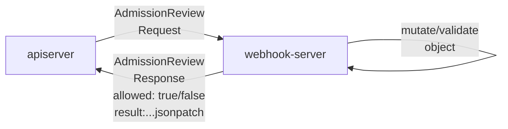

<!-- 系列链接 -->
[K8s CustomResourceDefinitions (CRD) internals]: ../2023-k8s-api-by-crd
[best practice for K8s api multi-version conversion]: ../2023-k8s-api-multi-version-conversion-best-practice
[simple K8s apiserver from scratch]: ../2023-k8s-apiserver-from-scratch
[K8s apiserver aggregation internals]: ../2023-k8s-apiserver-aggregation-internals
[The most thorough K8s code generation tutorial]: ../2023-k8s-api-codegen
[Implement K8s apiserver using library]: ../2023-k8s-apiserver-using-library
[Why custom K8s apiserver should avoid runtime?]: ../2023-k8s-apiserver-avoid-using-runtime
[K8s API Admission Control and Policy]: ../2023-k8s-api-admission

This post is one of the **K8s API and Controllers** series
- [K8s CustomResourceDefinitions (CRD) internals]
- [best practice for K8s api multi-version conversion]
- [simple K8s apiserver from scratch]
- [K8s apiserver aggregation internals]
- [The most thorough K8s code generation tutorial]
- [Implement K8s apiserver using library]
- [Why custom K8s apiserver should avoid runtime?]
- [K8s API Admission Control and Policy] (this post)

## 🎟️ What is Admission Control in K8s

Admission control is a module in kube-apiserver that intercepts requests before an object is persisted but after the request is authenticated and authorized. 
Any API request coming to kube-apiserver follows these steps:
1. Firstly, it passes filterchain, in which kube-apiserver does authn/authz to it
2. Then, it is dispatched by kube-aggregator to the corresponding sub apiserver's HTTP mux
3. After decoding/conversion/defaulting with [runtime.Scheme]
4. **The corresponding sub apiserver performs admission control on the request**
5. RESTStorage strategy will be executed, and it finally is persisted to etcd

The admission control is performed by [Admission Controllers].

> An admission controller is a piece of code that intercepts requests to 
    the Kubernetes API server prior to persistence of the object, 
> but after the request is authenticated and authorized.


[Admission Controllers] are quite common in K8s, For example (in v1.27.3 and most previous versions),
during the creation of a Pod, it will be mutated by ServiceAccount, Priority, and DefaultTolerationSeconds Admission Controller. As show below

```shell
cat << EOF | kubectl create --dry-run=server -o yaml -f -
apiVersion: v1
kind: Pod
metadata:
  name: web
spec:
  containers:
  - image: nginx
    name: web
EOF
---
apiVersion: v1
kind: Pod
metadata:
  creationTimestamp: "2023-07-05T08:35:42Z"   # generic registry Store
  name: web
  namespace: default                          # populated by kubectl, required by apiserver
  uid: e8645a53-4676-4fb7-9441-a91b549f293c   # generic registry Store
spec:
  containers:
  - image: nginx
    imagePullPolicy: Always   # defaults, Always for tag latest, IfNotPresent for other tags
    name: web
    resources: {}
    terminationMessagePath: /dev/termination-log  # defaults
    terminationMessagePolicy: File                # defaults
    volumeMounts:                           
    - mountPath: /var/run/secrets/kubernetes.io/serviceaccount <---+ 
      name: kube-api-access-rbr96                                  |--> by ServiceAccount Admission Controller
      readOnly: true                                           <---+ 
  dnsPolicy: ClusterFirst    # defaults
  enableServiceLinks: true   # defaults
  preemptionPolicy: PreemptLowerPriority   <-----------------------+
  priority: 0                              <-----------------------+--> by Priority Admission Controller
  restartPolicy: Always            # defaults
  schedulerName: default-scheduler # defaults
  securityContext: {}         
  serviceAccount: default       # conversion from serviceAccountName
  serviceAccountName: default   <--------------------------------------> by ServiceAccount Admission Controller
  terminationGracePeriodSeconds: 30
  tolerations:
  - effect: NoExecute              <--------------------------------+
    key: node.kubernetes.io/not-ready                               |
    operator: Exists                                                |
    tolerationSeconds: 300                                          |--> by DefaultTolerationSeconds Admission Controller
  - effect: NoExecute                                               |
    key: node.kubernetes.io/unreachable                             |
    operator: Exists                                                |
    tolerationSeconds: 300         <--------------------------------+
  volumes: 
  - name: kube-api-access-rbr96    <--------------------------------+
    projected:                                                      |
      defaultMode: 420                                              |
      sources:                                                      |
      - serviceAccountToken:                                        |
          expirationSeconds: 3607                                   |
          path: token                                               |
      - configMap:                                                  |
          items:                                                    |
          - key: ca.crt                                             |--> by ServiceAccount Admission Controller
            path: ca.crt                                            |
          name: kube-root-ca.crt                                    |
      - downwardAPI:                                                |
          items:                                                    |
          - fieldRef:                                               |
              apiVersion: v1                                        |
              fieldPath: metadata.namespace                         |
            path: namespace      <----------------------------------+
status:
  phase: Pending        # podStrategy.PrepareForCreate
  qosClass: BestEffort  # podStrategy.PrepareForCreate
```

When attempting to create a Pod within a namespace that does not exist in the cluster, a 404 response will be returned. This is handled by the NamespaceLifecycle Admission Controller.

```shell
kubectl -n ns-not-exist run nginx --image=nginx
Error from server (NotFound): namespaces "ns-not-exist" not found
```

Admission controllers perform deep inspection of a given request (including content).
Some controllers, such as the NamespaceLifecycle Admission Controller, validate the request and determine its admissibility. 
Others, like the ServiceAccount, Priority, and DefaultTolerationSeconds Admission Controllers, may mutate the content of the request.

All of the [Admission Controllers] are compiled-in kube-apiserver. For more detailed information, please click the link provided.

## 🧿 Admission internals

Admission is a module in [k8s.io/apiserver pkg/admission]. In which these interfaces are exposed to apiserver developer 
- An admission controller must implement Interface.Handles to decide whether to handle the incoming operation (CREATE, UPDATE, DELETE, or CONNECT), and MutationInterface or ValidationInterface to make an admission decision.
- The MutationInterface is also an admission Interface (by nesting). Its function `Admit` makes an admission decision, and is allowed mutate the request object
- The ValidationInterface is quite similar to MutationInterface, but its function `Validate` is not allowed to mutate the request object

All admission controllers are implementation of MutationInterface or ValidationInterface.
MutationInterface implementation can mutate and validate request content, but ValidationInterface implementation can only validate request content.

```
package admission

// Interface is an abstract, pluggable interface for Admission Control decisions.
type Interface interface {
	// Handles returns true if this admission controller can handle the given operation
	// where operation can be one of CREATE, UPDATE, DELETE, or CONNECT
	Handles(operation Operation) bool
}

type MutationInterface interface {
	Interface

	// Admit makes an admission decision based on the request attributes.
	// Context is used only for timeout/deadline/cancellation and tracing information.
	Admit(ctx context.Context, a Attributes, o ObjectInterfaces) (err error)
}

// ValidationInterface is an abstract, pluggable interface for Admission Control decisions.
type ValidationInterface interface {
	Interface

	// Validate makes an admission decision based on the request attributes.  It is NOT allowed to mutate
	// Context is used only for timeout/deadline/cancellation and tracing information.
	Validate(ctx context.Context, a Attributes, o ObjectInterfaces) (err error)
}
```
The official kube-apiserver has many [built-in admission plugins] on top of the admission package, 
and here's the detail of [built-in admission plugins register].
These built-in plugins are commonly known as [Admission Controllers]. 

## ✍️ Write an Admission Controller in apiserver

As admission control is performed after the dispatch of kube-aggregator, the custom apiserver should implement admission controllers by itself.

👻👻👻 If interested in K8s apiserver aggregation, you can read this post: [K8s apiserver aggregation internals].

Implementing the admission interfaces, then registering it to apiserver, that's all for writing an Admission Controller in apiserver.

As [x-kubernetes commit: add admission] shows

Firstly write the Admission Controller implements admission.ValidationInterface under pkg/admisssion

```go
package disallow

// Register registers a plugin
func Register(plugins *admission.Plugins) {
    plugins.Register("DisallowFoo", func(config io.Reader) (admission.Interface, error) {
        return &DisallowFoo{
            Handler: *admission.NewHandler(admission.Create),
        }, nil
    })
}

type DisallowFoo struct {
    admission.Handler // nested Handler implements admission.Interface
}

// Validate implements admission.ValidationInterface
func (d *DisallowFoo) Validate(ctx context.Context, a admission.Attributes, o admission.ObjectInterfaces) (err error) {
    // write admission code here
    return nil
}
```
Then register Admission Controller to Admission options and enactive admission module in apiserver

```go
func (o *Options) Complete() error {
    disallow.Register(o.Admission.Plugins) // register the Admission Controller
    o.Admission.RecommendedPluginOrder = append(o.Admission.RecommendedPluginOrder, "DisallowFoo")
    return nil
}

func (o Options) ApiserverConfig() {
    ... 
    // Apply Admission Options to apiserver config. 
    // If RecommendedOptions was used to configure apiserver, just call RecommendedOptions.ApplyTo.
    o.Admission.ApplyTo(&serverConfig.Config, serverConfig.SharedInformerFactory, serverConfig.ClientConfig, feature.DefaultFeatureGate)
    ...
}
```

Things happen in kube-apiserver are quite similar to it in custom apiserver
- [built-in admission plugins] are where the Admission Controller codes in
- [built-in admission plugins register] are codes about plugin register

[k8s.io/apiserver pkg/server/options.NewAdmissionOptions] provides a convinient way for admission module initialization, which register these necessary admission controllers for custom apiserver

- NamespaceLifecycle 
- MutatingAdmissionWebhook
- ValidatingAdmissionPolicy
- ValidatingAdmissionWebhook

NamespaceLifecycle is mostly used for custom object creation. The others are intended for dynamic policies.

## 🔮 Webhook and Policy

All of the [Admission Controllers] are compiled-in kube-apiserver, with three notable guys
1. MutatingAdmissionWebhook 
2. ValidatingAdmissionWebhook
3. ValidatingAdmissionPolicy

MutatingAdmissionWebhook and ValidatingAdmissionWebhook controller make third-party admission controller possible.
This two controller dynamically load and unload webhook configurations at runtime. 
The actual admisson controls are delegated to webhooks configured.

Applying the MutatingWebhookConfiguration below will install a mutating webhook to cluster.
Matching requests (any request with action create or update of any resources) will be forwarded to and reviewed by this webhook.

```yaml
apiVersion: admissionregistration.k8s.io/v1
kind: MutatingWebhookConfiguration # or ValidatingWebhookConfiguration
metadata:
  name: zeng.dev
webhooks:
- admissionReviewVersions: ["v1"] # accept admission/v1 AdmissionReview
  clientConfig:
    caBundle: ""
    # url: https://127.0.01:8000/validate # url or K8s service
    service: {"name": "foo", "namespace":"default", "port": 443, "path": "/admission"}
  name: hello.zeng.dev
  sideEffects: None
  rules:
  - apiGroups: ['*']     # match all apiGroups, ["", "apps"] match core group and apps group
    apiVersions: ['*']   # match all apiVersions, ["v1", "v1beta1"] match apiVersions v1 and v1beta1
    operations: ["CREATE", "UPDATE"]
    resources: ["*"]     # match all resources
  namespaceSelector: {}  # match all namesapces can use .matchExpressions to limit matching range
```

During admission control, MutatingAdmissionWebhook controller sends a [admission/v1 AdmissionReview] to this mutating webhook, with comming request in AdmissionReview.Request.
The webhook decodes the object from request, provides its mutation as JSONPatch in AdmissionReview.Response, and returns an [admission/v1 AdmissionReview] back to the apiserver.

If mutation and validation succeed, return AdmissionReview with Response field `allowed: true`, otherwise with `allowed: false`.



MutatingAdmissionWebhook admission controller calls any mutating webhooks which match the request. 
Matching webhooks are called in serial; each one may modify the object if it desires.

ValidatingAdmissionWebhook admission controller calls any validating webhooks which match the request. 
Matching webhooks are called in parallel; if any of them rejects the request, the request fails. 

**Validating webhooks must not mutate the object. So mutating webhooks can work as validating webhooks, but not vice versa.**

Mutating webhooks are similar to the built-in controller implements admission.MutationInterface, while
validating webhooks are similar to the built-in controller implements admission.ValidationInterface.


Admission webhooks are super powerful in K8s. A well-known example of mutating webhook is istio's [automatic sidecar injection](https://istio.io/latest/docs/setup/additional-setup/sidecar-injection/#automatic-sidecar-injection).

Another example is building policy management system based on admission webhook. 
[OPA/Gatekeeper] and [Kyverno] are popular policy engines. Its policies are defined as CRDs in Kubernetes native way. 

Once [OPA/Gatekeeper] or [Kyverno] deployed, user simply need to provide they policies as custom resources.
Webhook module of [OPA/Gatekeeper] and [Kyverno] will load user-defined policies and apply mutations/validations to the comming reuqest.

A Policy management system can enforce best practice for K8s usage, thereby improving cluster security, among other benefits. Out-of-the-box policies widely used in K8s community can be found at [OPA/Gatekeeper Library] and [Kyverno Policies].
Some of them are:
- Restrict Image Registries
- Pod Security Policies, such as enforce Pod spec.allowPrivilegeEscalation to false
- Automount Service Account Token for Pod
- Disallows all Services with type LoadBalancer
- Enforce Container Resources
- Add Certificates as a Volume
- Add Tolerations
- Disallow CRI socket mounts

For custom resources by custom apiserver, apply admisson control is simple and straightforward.
For custom resources by CRDs, the only option is the admission webhook.
Does any constraits, like validate resource field, deserve to implement and deploy a admission webhook?

In v1.26 Kubernetes imports Validating Admission Policy (powered by controller ValidatingAdmissionPolicy). 

> Validating admission policies offer a declarative, in-process alternative to validating admission webhooks.


ValidatingAdmissionPolicy is the official policy engine that use the [Common Expression Language (CEL)] to declare the validation rules of a policy. Compared to [OPA/Gatekeeper] and [Kyverno], Validating Admission Policy are really at early stage now (2023-7). Out-of-the-box policies are rare. 

Usage details can be found at [Kubernetes Documentation: Validating Admission Policy]. 

Repo [douglasmakey/k8s-validating-admission-policy] also provides good example.

Repo [kubescape/cel-admission-library](https://github.com/kubescape/cel-admission-library) contains out-of-the-box policies.

✅ The relationship between Validating Admission Policy and popular policy engines (such as [OPA/Gatekeeper], [Kyverno]) is not a matter of choosing one over the other, it can be a complementary relationship. [OPA/Gatekeeper] have [integration with K8s Validating Admission Policy](https://github.com/open-policy-agent/gatekeeper/issues/2682).

## ✍️ Write an Admission Webhook

My repo [denyenv-validating-admission-webhook](https://github.com/phosae/denyenv-validating-admission-webhook) is a validating webhook example.

//todo add mutating webhook example

## 📖 Further Reading

- [Admission Controllers]
- [OPA/Gatekeeper Library]
- [Kyverno Policies]
- [Kubernetes Documentation: Validating Admission Policy]
- [Common Expression Language (CEL)]
- [Playing with Common Expression Language](https://flavio.castelli.me/2022/07/21/playing-with-common-expression-language/)
- [KEP-492: Admission Webhooks](https://github.com/kubernetes/enhancements/tree/master/keps/sig-api-machinery/492-admission-webhooks)
- [KEP-3488: CEL for Admission Control](https://github.com/kubernetes/enhancements/tree/master/keps/sig-api-machinery/3488-cel-admission-control)

[k8s.io/apiserver pkg/admission]: https://github.com/kubernetes/apiserver/tree/master/pkg/admission
[built-in admission plugins]: https://github.com/kubernetes/kubernetes/tree/master/plugin/pkg/admission
[built-in admission plugins register]: https://github.com/kubernetes/kubernetes/blob/master/pkg/kubeapiserver/options/plugins.go
[Admission Controllers]: https://kubernetes.io/docs/reference/access-authn-authz/admission-controllers/
[runtime.Scheme]: https://github.com/kubernetes/apimachinery/blob/6b1428efc73348cc1c33935f3a39ab0f2f01d23d/pkg/runtime/scheme.go#L46
[k8s.io/apiserver pkg/server/options.NewAdmissionOptions]: https://github.com/kubernetes/apiserver/blob/0e613811b6d0e41341abffac5a2f423eeee0fbaf/pkg/server/options/admission.go#L81-L95

[admission/v1 AdmissionReview]: https://github.com/kubernetes/api/blob/master/admission/v1/types.go#L28-L37
[OPA/Gatekeeper]: https://github.com/open-policy-agent/gatekeeper
[Kyverno]: https://github.com/kyverno/kyverno
[OPA/Gatekeeper Library]: https://open-policy-agent.github.io/gatekeeper-library/website/
[Kyverno Policies]: https://kyverno.io/policies/

[Kubernetes Documentation: Validating Admission Policy]: https://kubernetes.io/docs/reference/access-authn-authz/validating-admission-policy/
[Common Expression Language (CEL)]: https://github.com/google/cel-spec
[douglasmakey/k8s-validating-admission-policy]: https://github.com/douglasmakey/k8s-validating-admission-policy

[x-kubernetes commit: add admission]: https://github.com/phosae/x-kubernetes/commit/c2bfa30485677249374dbb582e8a111c0b897f0c