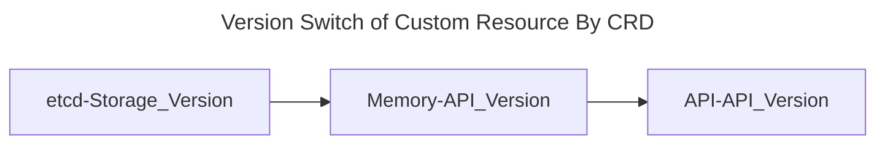
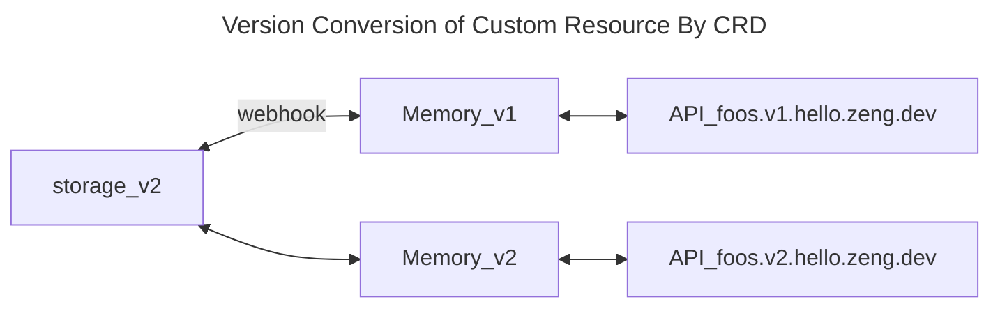
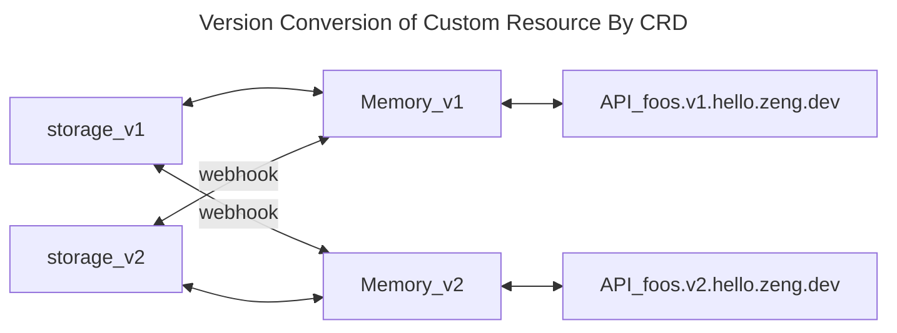
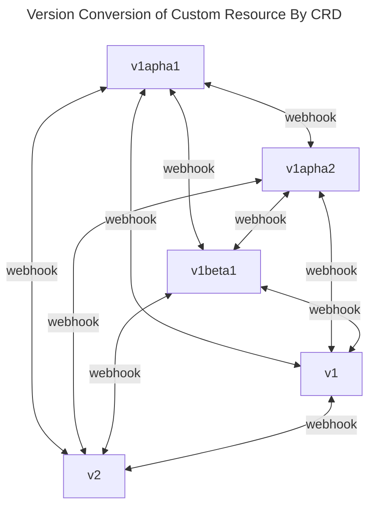
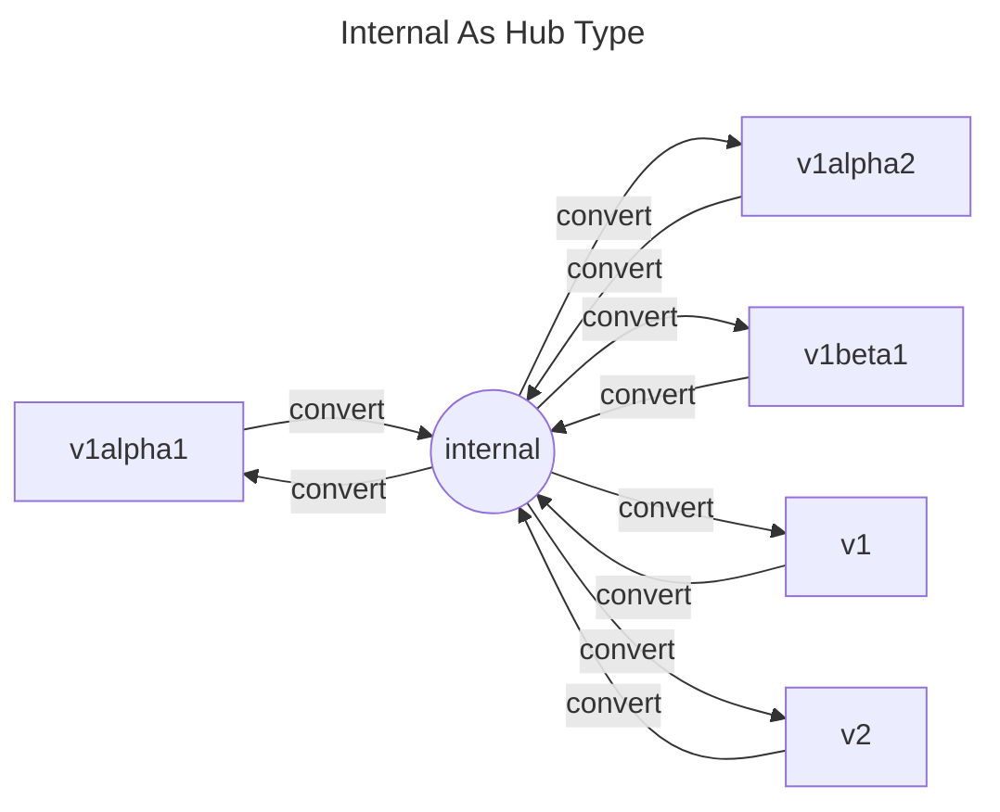
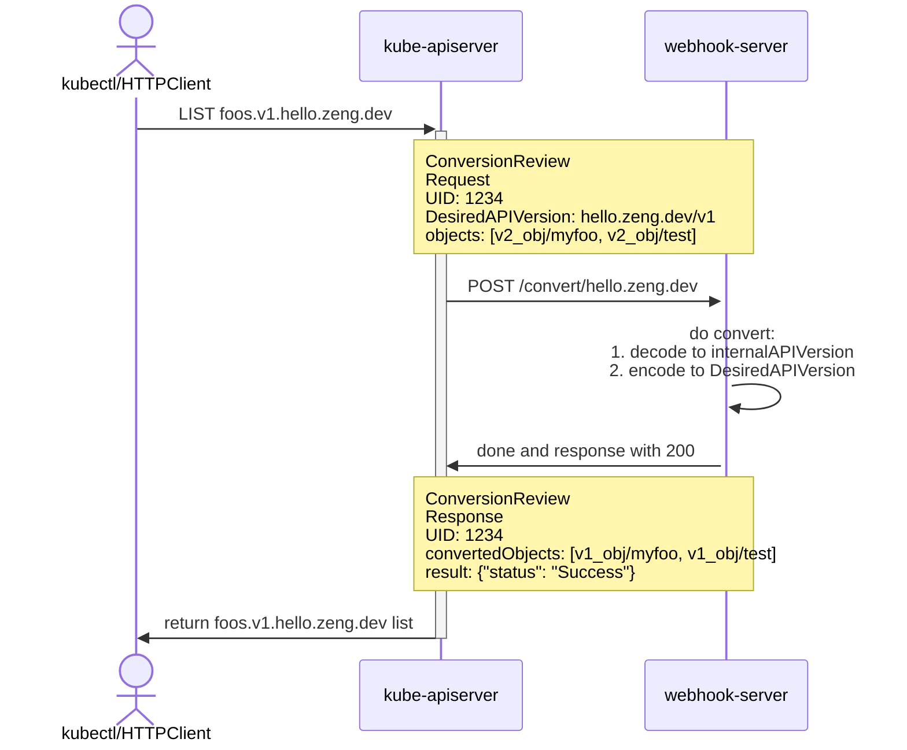

<!-- 系列链接 -->
[CustomResourceDefinitions (CRD) 原理]: ../2023-k8s-api-by-crd
[K8s 多版本 API 转换最佳实践]: ../2023-k8s-api-multi-version-conversion-best-practice
[实现一个极简 apiserver]: ../2023-k8s-apiserver-from-scratch
[搞懂 apiserver aggregation]: ../2023-k8s-apiserver-aggregation-internals
[最不厌其烦的 K8s 代码生成教程]: ../2023-k8s-api-codegen
[使用 library 实现 K8s apiserver]: ../2023-k8s-apiserver-using-library
[慎重选用 Runtime 类框架开发 K8s apiserver]: ../2023-k8s-apiserver-avoid-using-runtime
[K8s API Admission Control and Policy]: ../2023-k8s-api-admission

本文为 **K8s API 和控制器** 系列文章之一
- [CustomResourceDefinitions (CRD) 原理]
- [K8s 多版本 API 转换最佳实践] (本文)
- [实现一个极简 apiserver]
- [搞懂 apiserver aggregation]
- [最不厌其烦的 K8s 代码生成教程]
- [使用 library 实现 K8s apiserver]
- [慎重选用 Runtime 类框架开发 K8s apiserver]
- [K8s API Admission Control and Policy]

## Versions in apiserver

[使用 library 实现 K8s apiserver] 讲到了 apiserver 中多版本 API 转换的核心 —— 定义内部版本，将其作为所有外部版本转换的枢纽 (Hub)。内部版本可随代码变动，而外部版本则保持着 API 稳定。


```bash
~/x-kubernetes/api# tree hello.zeng.dev/ # here defines the external API
hello.zeng.dev/
├── v1
│   └── types.go                         # here defines the v1 kinds
└── v2
    └── types.go                         # here defines the v2 kinds
---
~/x-kubernetes/api-aggregation-lib# tree pkg/api/ # here defines the internal API and the conversion
pkg/api/
└── hello.zeng.dev
    ├── v1
    │   └── conversion.go                         # here defines v1 🔄 internal
    ├── v2
    │   └── zz_generated.conversion.go            # here defines v2 🔄 internal
    └── types.go                                  # here defines the internal version
```

## Versions in CRD

K8s CRD `spec.versions` 本身是一个数组，可以为对应的 Custom Resource 定义多个版本 API。

[x-kubernetes/api] 引入 v2 时，也同时更新了对应 CRD (见 [Commit: add hello.zeng.dev/v2])，并在 [Commit: gen v2 codes] 生成了 CRD OpenAPIV3 Schema。

```yaml
apiVersion: apiextensions.k8s.io/v1
kind: CustomResourceDefinition
metadata:
  name: foos.hello.zeng.dev
spec:
  group: hello.zeng.dev
  names:
    kind: Foo
    ...
  versions:
  - name: v1
    served: true
-   storage: true
+   storage: false
    ...
+ - name: v2
+   served: true
+   storage: true
+   additionalPrinterColumns: '{...}'
+   schema:
+     openAPIV3Schema: {}
```

CRD 每版本有两个 bool 字段
- served 表示是否对外暴露，可用于废弃 API
- storage 表示是否为存储版本，所有版本中有且只有一个可以为 true

[Commit: add hello.zeng.dev/v2] 除了增加 v2 版本 API 之外，同时将 storage version 调整为 v2。

CRD 定义的 Custom Resource 在 kube-apiserver 各层次的表现形式是
- 存储: Storage Version（在 custom apiserver 实现中是 preferredVersion）
- 内存: API Version（在 custom apiserver 实现中是内部版本）
- API: API Version



当存储版本和内存版本不一致时，就需要进行版本转换。这便轮到 CRD 字段 `spec.conversion` 出场。CRD 支持两种转换策略：None 和 Webhook。None 仅是将存储字节进行 JSON 反序列化到对应版本，字段对不上时就会产生损失。所以常用策略是 Webhook。

```yaml
apiVersion: apiextensions.k8s.io/v1
kind: CustomResourceDefinition
metadata:
  name: foos.hello.zeng.dev
spec:
  group: hello.zeng.dev
  names:
    kind: Foo
    ...
  scope: Namespaced
  conversion:
    strategy: Webhook # or None
    webhook:  # webhook config when strategy is 'Webhook'
      clientConfig:
        caBundle: '...'
        service:
          name: foo-crd-converter
          namespace: default
          path: /convert/hello.zeng.dev
          port: 443
      conversionReviewVersions:
      - v1
```

当存储版本为 v2，且 etcd 中只存有 v2 时，转换关系很容易理解
- 如果请求 API 版本为 v1，需要调用 webhook 做转换
- 如果请求 API 版本为 v2，则无需调用 webhook

因此，Webhook 
- 在读取方向，需要支持 v2 ➡️ v1
- 在写入方向，需要支持 v1 ➡️ v2



考虑到原先的 storage version 为 v1，现在的 storage version 为 v2。因此存储中可能同时存在 v1 v2 两个版本，实际的转换关系应该是这样的



⚠️🧿 注意：只有发生更新写入，已存储的对象才会被更新为最新的 storage version

此时，Webhook 没有啥变化，还是仅需提供两种转换
- 在读取方向，需要支持 v1 ➡️ v2，v2 ➡️ v1
- 在写入方向，需要支持 v1 ➡️ v2，v2 ➡️ v1

设想一些更复杂的场景，假设 API 经历了 5 个 storage version 变更 (v1apha1 ⬆️ v1apha2 ⬆️ v1beta1 ⬆️ v1 ⬆️ v2)
- v1apha1 ⬆️ v1apha2 ⬆️ v1beta1: 需要支持 6 种转换
- v1apha1 ⬆️ v1apha2 ⬆️ v1beta1 ⬆️ v1: 需要支持 12 种转换
- v1apha1 ⬆️ v1apha2 ⬆️ v1beta1 ⬆️ v1 ⬆️ v2: 需要支持 20 种转换




推演到 v1apha1 ⬆️ ... ⬆️ n，需要支持 n*(n-1) 种转换，每增加一个版本，增加的转换关系是 2*(n-1)，其中 n 指版本数量。

## Best Practice for Objects Conversion 

综合上述分析，不难发现处理版本转换的最佳实践：定义唯一内部版本，所有转换围绕内部版本进行。这样每增加一个 API 版本，仅需增加 2 个转换函数。

<style> .mermaid svg { width: 72%;} </style>



写一个 apiserver 提供 API，只需照搬 kube-apiserver 即遵循了最佳实践。

基于 CRD 提供 API，遵循版本转换的最佳实践的方式有这么几种
1. 🌓 在 CRD 引入之初，将某个版本（如 v1alpha1）定义为内部 Hub 版本，并且不对外暴露 (served=false)，外部版本和 storage version 按照 v1alpha2 ➡️ v1beta1 ➡️ v1beta2 ➡️ v1 ➡️ v2 演进，所有转换围绕非公开版本 v1alpha1 进行
2. 🌚 总是使用最新版本（如 v2）做 Hub，每次更新版本后，都把存储中的资源对象更新到最新版本
3. ✅ 在 Webhook Server 中定义内部 Hub 版本，CRD API 版本随意增加，Storage 版本随意更新，转换时，总是先将源版本转换到内部版本，在从内部版本转换到目标版本

[Kubebuilder] 采用了类似 1 的方式，这种方法会造成 CRD 定义不明。看到 served=false，你会以为是某个可以废弃的 API 版本，而不是什么内部版本。

2 在实际操作上比较麻烦，对应项目 [kube-storage-version-migrator] 也很久不更新了，因此不推荐。

最好的方式是 3，内部版本永远只存在内存中。它贴着代码走，随代码演进就行。

## Hands on Conversion Webhook Server
Webhook Server 实现方式和 apiserver 异曲同工，先定义内部 api，并使用和 apiserver 一致的方式生成转换函数

```bash
~/x-kubernetes/api/crdconversion# tree internal/api/ # here defines the internal API and the conversion
internal/api/
└── hello.zeng.dev
    ├── install
    │   └── install.go     # here defines helper funcs for Scheme installation
    ├── v1
    │   └── conversion.go  # here defines v1 🔄 internal
    ├── v2
    │   └── zz_generated.conversion.go  # here defines v2 🔄 internal
    └── types.go  # here defines the internal version
```

主要转换过程如下
1. kube-apiserver 向 webhook-server 发起 POST 请求，输入数据为 ConversionReview，其 ConversionReview.Requset 中包含了 3 个字段
   * UID 用于唯一标识该请求，webhook-server 需要在相应中返回
   * desiredAPIVersion 表示目标版本
   * objects 中包含了 storageAPIVersion 对象
2. webhook-server 解析请求为程序结构体/对象，读取 ConversionReview.Requset 并开始转换
   * 转换 storageAPIVersion 为 internalAPIVersion
   * 转换 internalAPIVersion 为 desiredAPIVersion
3. webhook-server 构建 ConversionReview 并返回 ConversionReview.Response, Response 中包含如下内容
   * UID 对应于 ConversionReview.Requset.UID
   * convertedObjects 包含了转换后的 desiredAPIVersion 对象
   * result 表示转换是否成功，`{"status": "Success"}` 表示成功 `{"status": "Failure"}` 表示失败



对象转换处理代码如下，核心就是往 Scheme 注册 API 和转换函数，利用 k8s.io/apimachinery versioning serializer decode/encode 转换即可

```go
import(
    apix "k8s.io/apiextensions-apiserver/pkg/apis/apiextensions/install"
    apixv1 "k8s.io/apiextensions-apiserver/pkg/apis/apiextensions/v1"
    "k8s.io/apimachinery/pkg/runtime"
    "k8s.io/apimachinery/pkg/runtime/schema"
    kjson "k8s.io/apimachinery/pkg/runtime/serializer/json"
    "k8s.io/apimachinery/pkg/runtime/serializer/versioning"

    helloinstall "github.com/phosae/x-kubernetes/api/crdconversion/internal/api/hello.zeng.dev/install"
)

var (
	scheme          = runtime.NewScheme()
	kjsonSerializer = kjson.NewSerializer(kjson.DefaultMetaFactory, scheme, scheme, false)
)

func init() {
	apix.Install(scheme)
	metav1.AddMetaToScheme(scheme)
	helloinstall.Install(scheme)
)

func ConvertHello(req *apixv1.ConversionRequest) (*apixv1.ConversionResponse, error) {
	resp := apixv1.ConversionResponse{}

	desiredGV, err := schema.ParseGroupVersion(req.DesiredAPIVersion)
	...

	groupVersioner := schema.GroupVersions([]schema.GroupVersion{desiredGV})
	codec := versioning.NewCodec(
		kjsonSerializer,                       // decoder
		kjsonSerializer,                       // encoder
		runtime.UnsafeObjectConvertor(scheme), // convertor
		scheme,                                // creator
		scheme,                                // typer
		nil,                                   // defaulter
		groupVersioner,                        // encodeVersion
		runtime.InternalGroupVersioner,        // decodeVersion
		scheme.Name(),                         // originalSchemeName
	)

	convertedObjects := make([]runtime.RawExtension, len(req.Objects))
	for i, raw := range req.Objects {
		decodedObject, _, err := codec.Decode(raw.Raw, nil, nil)
		if err != nil {
			return nil, fmt.Errorf("failed to decode into apiVersion: %v", err)
		}
		buf := bytes.Buffer{}
		if err := codec.Encode(decodedObject, &buf); err != nil {
			return nil, fmt.Errorf("failed to convert to desired apiVersion: %v", err)
		}
		convertedObjects[i] = runtime.RawExtension{Raw: buf.Bytes()}
	}
	resp.ConvertedObjects = convertedObjects
	return &resp, nil
}
```

最后，你可以直接 clone 并把玩源代码（麻烦顺手 star ⭐🤩🌈

    git clone https://github.com/phosae/x-kubernetes.git
    cd x-kubernetes && make localenv
    cd api/crdconversion
    make deploy

延伸阅读
1. [Kubernetes Documentation: Versions in CustomResourceDefinitions]
2. [Kubebuilder doc: multiversion-tutorial]

[x-kubernetes]: https://github.com/phosae/x-kubernetes
[x-kubernetes/api]: https://github.com/phosae/x-kubernetes/tree/master/api
[Commit: add hello.zeng.dev/v2]: https://github.com/phosae/x-kubernetes/commit/8cc7165a09ea4f01f3f4c132e20e5c060910f379#diff-4a9a9951613b198ef33362bf60e70c5f9af66d67fc4410c5a582db90471fa65d
[Commit: gen v2 codes]: https://github.com/phosae/x-kubernetes/commit/6ef463dc1d251f2f267de9598e98453cbad3fe57#diff-4a9a9951613b198ef33362bf60e70c5f9af66d67fc4410c5a582db90471fa65d

[Kubebuilder]: Kubebuilder
[kube-storage-version-migrator]: https://github.com/kubernetes-sigs/kube-storage-version-migrator
[Kubebuilder doc: multiversion-tutorial]: https://kubebuilder.io/multiversion-tutorial/conversion.html
[Kubernetes Documentation: Versions in CustomResourceDefinitions]: https://kubernetes.io/docs/tasks/extend-kubernetes/custom-resources/custom-resource-definition-versioning