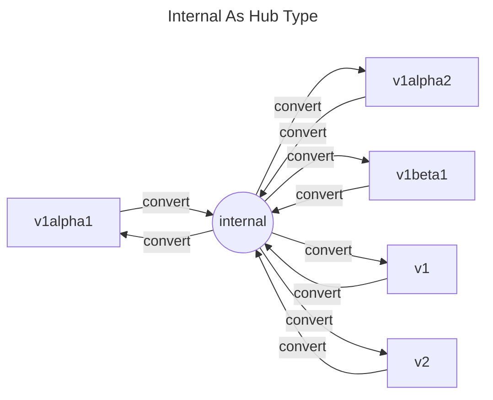
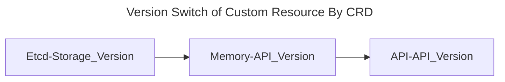
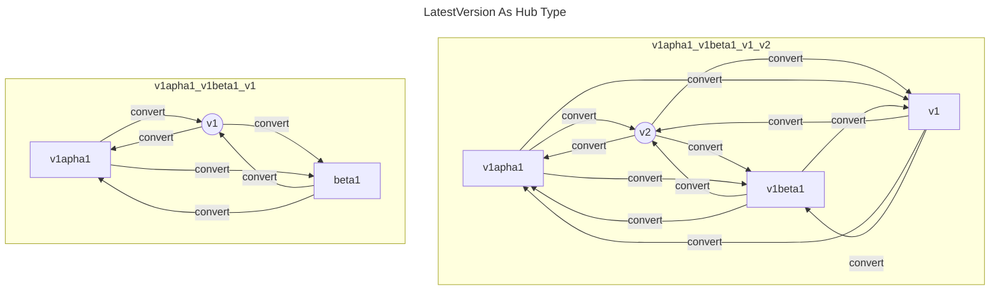
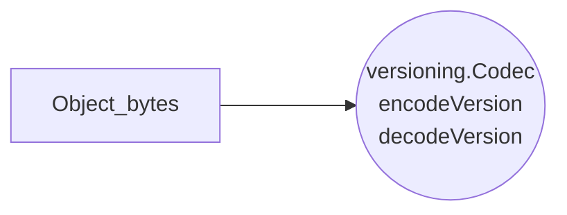

<!-- 系列链接 -->
[CustomResourceDefinitions (CRD) 原理]: ../2023-k8s-api-by-crd
[CRD API 多版本]: ../2023-k8s-api-versioning-by-crd
[实现一个极简 apiserver]: ../2023-k8s-apiserver-from-scratch
[搞懂 apiserver aggregation]: ../2023-k8s-apiserver-aggregation-internals
[最不厌其烦的 K8s 代码生成教程]: ../2023-k8s-api-codegen
[使用 library 实现 K8s apiserver]: ../2023-k8s-apiserver-using-library
[慎重选用 Runtime 类框架开发 K8s apiserver]: ../2023-k8s-apiserver-avoid-using-runtime

本文为 **K8s API 和控制器** 系列文章之一
- [CustomResourceDefinitions (CRD) 原理]
- [CRD API 多版本] (本文)
- [实现一个极简 apiserver]
- [搞懂 apiserver aggregation]
- [最不厌其烦的 K8s 代码生成教程]
- [使用 library 实现 K8s apiserver]
- [慎重选用 Runtime 类框架开发 K8s apiserver]

[使用 library 实现 K8s apiserver] 讲到了 apiserver 中多版本 API 转换的核心 —— 定义内部版本，将其作为所有外部版本转换的枢纽 (Hub)。内部版本可随代码变动，而外部版本则保持着 API 稳定。


其实定义内部版本一大好处是：降低代码复杂度，即每增加加一个 API 版本，仅需增加 2 个转换函数。

<style> .mermaid svg { width: 72%;} </style>



## Version Conversion in CustomResourceDefinitions

K8s CRD `spec.versions` 本身是一个数组，可以为对应的 Custom Resource 定义多个版本 API。

在 [x-kubernetes/api] 引入 v2 时，也同时更新了对应 CRD (见 [Commit: add hello.zeng.dev/v2])，并在 [Commit: gen v2 codes] 生成了 CRD OpenAPIV3 Schema。

```yaml
apiVersion: apiextensions.k8s.io/v1
kind: CustomResourceDefinition
metadata:
  name: foos.hello.zeng.dev
spec:
  group: hello.zeng.dev
  names:
    kind: Foo
    ...
  versions:
  - name: v1
    served: true
-   storage: true
+   storage: false
    ...
+ - name: v2
+   served: true
+   storage: true
+   additionalPrinterColumns: '{...}'
+   schema:
+     openAPIV3Schema: {}
```

CRD 每版本有两个 bool 字段
- served 表示是否对外暴露，可用于废弃 API
- storage 表示是否为存储版本，所有版本中有且只有一个可以为 true

在这次升级中，增加了 v2 版本 API，同时调整 storage version 为 v2

CRD 定义的 Custom Resource 在 kube-apiserver 各层次的表现形式是
- 存储: Storage Version（在 custom apiserver 实现中是 preferredVersion）
- 内存: API Version（在 custom apiserver 实现中是内部版本）
- API: API Version



当存储版本和内存版本不一致时，就需要进行版本转换。这便轮到 CRD 字段 `spec.conversion` 出场。CRD 支持两种转换策略：None 和 Webhook。None 仅是将存储字节进行 JSON 反序列化到对应版本，字段对不上时就会产生损失。所以常用策略是 Webhook。

```yaml
apiVersion: apiextensions.k8s.io/v1
kind: CustomResourceDefinition
metadata:
  name: foos.hello.zeng.dev
spec:
  group: hello.zeng.dev
  names:
    kind: Foo
    ...
  scope: Namespaced
  conversion:
    strategy: Webhook # or None
    webhook:  # webhook config when strategy is 'Webhook'
      clientConfig:
        caBundle: '...'
        service:
          name: foo-crd-converter
          namespace: default
          path: /convert/hello.zeng.dev
          port: 443
      conversionReviewVersions:
      - v1
```

KV 存储格式：/registry/{group}/{kind_plural}/{namespace}/{name} - Object，如
- /registry/hello.zeng.dev/foos/default/myfoo
- /registry/pods/kube-system/kube-apiserver-nodex

<style> .mermaid svg { width: 80%;} </style>





[x-kubernetes]: https://github.com/phosae/x-kubernetes
[x-kubernetes/api]: https://github.com/phosae/x-kubernetes/tree/master/api
[Commit: add hello.zeng.dev/v2]: https://github.com/phosae/x-kubernetes/commit/8cc7165a09ea4f01f3f4c132e20e5c060910f379#diff-4a9a9951613b198ef33362bf60e70c5f9af66d67fc4410c5a582db90471fa65d
[Commit: gen v2 codes]: https://github.com/phosae/x-kubernetes/commit/6ef463dc1d251f2f267de9598e98453cbad3fe57#diff-4a9a9951613b198ef33362bf60e70c5f9af66d67fc4410c5a582db90471fa65d

[Kubernetes Documentation: Versions in CustomResourceDefinitions]: https://kubernetes.io/docs/tasks/extend-kubernetes/custom-resources/custom-resource-definition-versioning