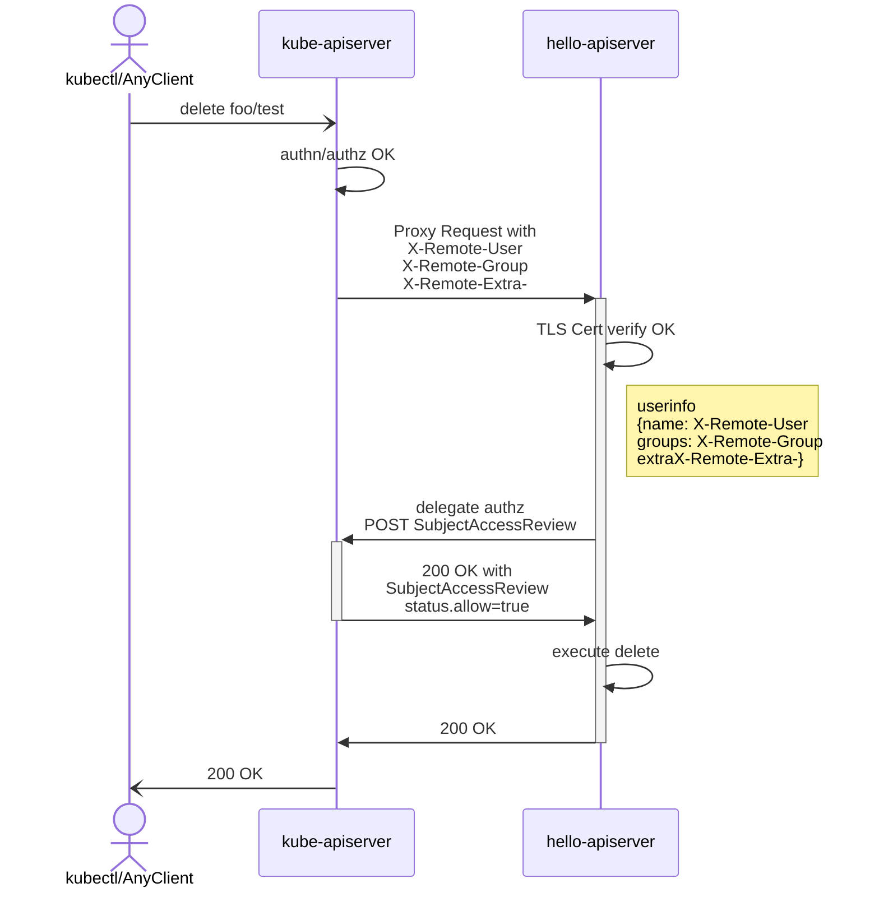
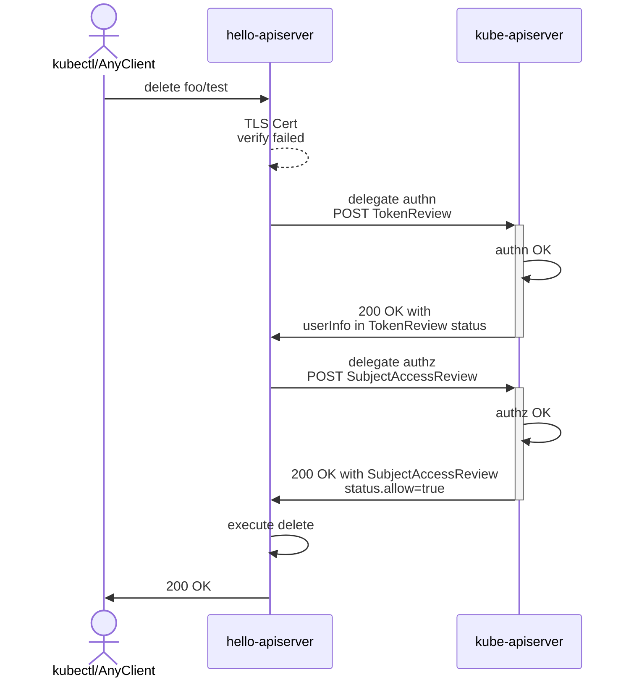

<!-- 系列链接 -->
[K8s CustomResourceDefinitions (CRD) 原理]: ../2023-k8s-api-by-crd
[K8s 多版本 API 转换最佳实践]: ../2023-k8s-api-multi-version-conversion-best-practice
[实现一个极简 K8s apiserver]: ../2023-k8s-apiserver-from-scratch
[搞懂 K8s apiserver aggregation]: ../2023-k8s-apiserver-aggregation-internals
[最不厌其烦的 K8s 代码生成教程]: ../2023-k8s-api-codegen
[使用 library 实现 K8s apiserver]: ../2023-k8s-apiserver-using-library
[慎重选用 Runtime 类框架开发 K8s apiserver]: ../2023-k8s-apiserver-avoid-using-runtime
[K8s API Admission Control and Policy]: ../2023-k8s-api-admission

本文为 **K8s API 和控制器** 系列文章之一
- [K8s CustomResourceDefinitions (CRD) 原理]
- [K8s 多版本 API 转换最佳实践]
- [实现一个极简 K8s apiserver]
- [搞懂 K8s apiserver aggregation] (本文)
- [最不厌其烦的 K8s 代码生成教程]
- [使用 library 实现 K8s apiserver]
- [慎重选用 Runtime 类框架开发 K8s apiserver]
- [K8s API Admission Control and Policy]

## 🤔 How APIService Works

[实现一个极简 K8s apiserver] 展示了使用 APIService 将 custom apiserver 聚合到 kube-apiserver。聚合（aggregation）由模块  kube-aggregator 实现，其原理如下

0. kube-aggregator watch 所有 APIService 资源，所有三方 APIService 都会按照 `spec.service` 字段解析成 Service `{name}.{namespace}:<port>`。Service 为背后 apiserver 提供负载均衡
1. 启动 proxyHandler，反向代理三方 apiserver 所有流量。CRUD  API 如 `/apis/hello.zeng.dev/v1/**` 和 `/apis/metrics.k8s.io/v1beta1/**`，全部交给对应 apiserver 处理
2. 通过 proxyHandlers 访问所有 apiservers 路径 /openapi/v2 和 /openapi/v3，聚合所有 OpenAPI Specification 信息在 /openapi/v2 和 /openapi/v3
3. 通过 proxyHandlers 访问所有 apiservers 服务发现路径 /apis (1.27+) 或者 /apis ➕ /apis/{spec.group}/{spec.version}，聚合所有服务发现信息，在 /apis, /apis/{spec.group} 和 /apis/{spec.group}/{spec.version} 统一提供服务发现


⚠️⚠️⚠️ 注意 ⚠️⚠️⚠️
1. kube-aggregator 通过路径 `/apis/{spec.group}/{spec.version}` 发起存活检测，如果未通过，访问三方 apiserver 时 proxyHandler 返回 `503 Service Unavailable`
2. 如果三方 apiserver 只提供 OpenAPI Specification v2，kube-aggregator 会自动转换出一份 v3 版本

## 👑 The Builtin Aggregation and HandlerChain

[K8s CustomResourceDefinitions (CRD) 原理] 谈到了 kube-apiserver 引入 CustomResourceDefinitions 时的做法：采用委托模式组合核心 kube-apiserver 模块和 apiextensions-apiserver 模块，收到客户端服务请求时，先到核心模块寻找支持，再到拓展模块寻找支持，最后再返回 404。

实际上 kube-apiserver 模块又以委托模式组合在 kube-aggregator 模块内。
官方内置 API Groups 和三方 API Groups 使用了同一套框架，每个内置 API GroupVersion 都会创建默认 APIService，但在代理模式上有所区别

1. 每个内置 API GroupVersion 对应 APIService 都会打上 Local 标识，诸如 `/api/**`, `/apis/apps/**`, `/apis/batch/**`, `/apis/{crd.group}` 等路径，直接通过模块委托交给同进程 kube-apiserver 模块处理，而非走网络代理
2. Discovery API 和 OpenAPI Specification 由 HTTP 请求聚合改为了直接读内存聚合

模块嵌套加上 [通用 filters/middlewares](https://github.com/kubernetes/kubernetes/blob/039ae1edf5a71f48ced7c0258e13d769109933a0/staging/src/k8s.io/apiserver/pkg/server/config.go#L890-L960)，构成了客户端请求进入具体 apiserver 实现之前的流程


```
  filterchain
+---------------+
| panic recover |        +-- hello.zeng.dev-apiserver ---> /apis/hello.zeng.dev/**
|   ↓           |        │
| tracing       |        |  +--- metrics-apiserver ---> /apis/metmetrics.k8s.io/**
|   ↓           |        |  │
| log           |        proxy
|   ↓           |        ↑  ↑
| timeout       +---> kube-aggregator ---> /api/**, /apis/**, /openapi/v2, /openapi/v3/**
|   ↓           |         ↓            
|*authentication|      delegate
|   ↓           |         │                       core/legacy group  /api/**
| audit         |         └── kube-apiserver ---> official groups   [/apis/apps/**, /apis/batch/**, ...]
|   ↓           |                 ↓
| impersonation |              delegate
|   ↓           |                 │
| flowControl   |                 └── apiextensions-apiserver ---> CRD groups            /apis/apiextensions.k8s.io/**
|   ↓           |                         ↓                        cutsomresource groups /apis/{crd.group}/**
|*authorization |                      delegate
+---------------+                         │
                                          └── notfoundhandler ---> 404 NotFound
```

与 custom apiserver 最相关的 kube-aipserver filters 是鉴权 authentication(authn) 和授权 authorization(authz)
- authn 根据客户端凭证，鉴别出用户信息 `(name, uid, groups, extra)`，未通过返回 `401 Unauthorized`
- authz 根据用户信息，主要是 `(name, groups)`，查询用户具有何种权限（通常是 RBAC），未通过返回 `403 Forbidden`

kube-apiserver 详细 authn authz 概念在这里查看
- [kube-apiserver 用户概念、authn 策略](https://github.com/kubernetes/website/blob/2c3355839f6b475cd6a2e8faeb4015324f7d447f/content/en/docs/reference/access-authn-authz/authentication.md)
- [kube-apiserver authz modes](https://github.com/kubernetes/website/blob/2c3355839f6b475cd6a2e8faeb4015324f7d447f/content/en/docs/reference/access-authn-authz/authorization.md#authorization-modes-authorization-modules)

## ✍️ How should custom apiserver do authn and authz ?

客户端请求抵达三方 apiserver 有两种
1. 经 kube-apiserver 反向代理到达
2. 客户端直接发起

请求能经 kube-apiserver 反向代理到达 custom apiserver，表明它已经通过 kube-apiserver 的 authn 和 authz。被代理的 HTTP 请求会带有这些 Header
- `X-Remote-User`，authn name
- `X-Remote-Group`，authn groups
- `X-Remote-Extra-{key}`，authn extra key value

分别对应用户信息 `(name, groups, extra)`。

⚠️⚠️⚠️ 注意 ⚠️⚠️⚠️ 
此三项 Header 在 kube-apiserver 中由三个配置项控制，通常按约定写死无必要改动
- `--requestheader-username-headers`，协定为 `X-Remote-User`
- `--requestheader-group-headers`，协定为 `X-Remote-Group`
- `--requestheader-extra-headers-prefix`，协定为 `X-Remote-Extra-`

custom apiserver 首先应该能够鉴别请求是否来自 kube-apiserver 代理。

为解决此问题，kube-apiserver 中还有几项配置

- `--requestheader-client-ca-file`，path to aggregator CA cert，kube-apiserver proxy 请求 TLS 证书签发 CA
- `--requestheader-allowed-names`，通常是 front-proxy-client，对应 proxy 模块证书里头的 Common Name 字段
- `--proxy-client-cert-file`，path to aggregator proxy cert，kube-apiserver proxy 请求 TLS 证书
- `--proxy-client-key-file`，path to aggregator proxy key，kube-apiserver proxy 请求 TLS 私钥

kube-apiserver 所需 proxy CA 和 proxy 证书会在集群启动前时由 kubeamd 等工具（也可以由管理员手工）生成好。kube-apiserver 生成时会往 kube-system namespace 写入 ConfigMap/extension-apiserver-authentication。

运行在 K8s 中的 custom apiserver 首先应该绑定 Kubernetes 内置的如下权限

```yaml
apiVersion: rbac.authorization.k8s.io/v1
kind: Role
metadata:
  name: extension-apiserver-authentication-reader
  namespace: kube-system
rules:
- apiGroups:
  - ""
  resourceNames:
  - extension-apiserver-authentication
  resources:
  - configmaps
  verbs:
  - get
  - list
  - watch
```

custom apiserver 处理请求时
- 首先应进行客户端 TLS 证书验证：先看是否由 client-ca-file 签发，再验证 TLS 证书 Common Name 是否为 allowed-names 之一。验证通过表明流量来自 kube-apiserver，自 `(X-Remote-User, X-Remote-Group, X-Remote-Extra-*)` 提取出 authn 信息。否则
- 请求非可信，应当对其执行 authn

而一般地，所有用户、权限信息又只保存在 kube-apiserver。kube-apiserver 提供了一个专供 authn 的 HTTP POST 接口 `/apis/authentication.k8s.io/v1/tokenreviews` 解决此类 authn 问题

假设 token 来自 namespace hello 下的 service account me，authn 过程如下

```
curl -v -XPOST  -H "Accept: application/json" -H "Content-Type: application/json" \
https://10.96.0.1:443/apis/authentication.k8s.io/v1/tokenreviews -d '

{
  "apiVersion": "authentication.k8s.io/v1",
  "kind": "TokenReview",
  "spec": {
    "token": "014fbff9a07c..."
  }
}'
```

kube-apiserver authn 该 token，通过后返回

```
{
  "apiVersion": "authentication.k8s.io/v1",
  "kind": "TokenReview",
  "spec": {
    "token": "014fbff9a07c..."
  },
  "status": {
    "username": "system:serviceaccount:hello:me",
    "uid": "685c1d52-ab61-49be-9228-a3fa1e839a77", 
    "groups": [ "system:serviceaccounts", "system:serviceaccounts:hello", "system:authenticated"] 
  }
}'
```

authn 取得用户信息之后，还需要进行 authz，才真正到达业务处理。针对这类 authz ，kube-apiserver 接口是 `POST /apis/authorization.k8s.io/v1/subjectaccessreviews`

假设 custom apiserver 需要 authz serviceaccount hello/me 是否能够 list /apis/hello.zeng.dev/namespaces/default/foos，交互协议如下（服务端用 JSON 传输

```bash
curl -v -XPOST  -H "Accept: application/yaml" -H "Content-Type: application/yaml" \
'https://10.96.0.1:443/apis/authorization.k8s.io/v1/subjectaccessreviews?timeout=10s' -d '
kind: SubjectAccessReview
apiVersion: authorization.k8s.io/v1
metadata: {}
spec:
  resourceAttributes:
    namespace: default
    verb: list
    group: hello.zeng.dev
    version: v1
    resource: foos
  user: system:serviceaccount:hello:me
  groups:
  - system:serviceaccounts
  - system:serviceaccounts:hello
  - system:authenticated
  uid: 7c34f861-56c5-491d-a69c-6826fcd8578d
status:
  allowed: false'
```

kube-apiserver 响应会更新 status 字段，如果 `.status.allow` 为 true 表明 authz 成功

```yaml
---
kind: SubjectAccessReview
apiVersion: authorization.k8s.io/v1
metadata: {}
spec: {...} # spec 与送入保持一致
status:
  allowed: true
```

所以 custom apiserver 通常还会绑定如下 Kubernetes 内置权限，才能将 authn 和 authz 委托给 kube-apiserser

```yaml
apiVersion: rbac.authorization.k8s.io/v1
kind: ClusterRole
metadata:
  name: system:auth-delegator
rules:
- apiGroups:
  - authentication.k8s.io
  resources:
  - tokenreviews
  verbs:
  - create
- apiGroups:
  - authorization.k8s.io
  resources:
  - subjectaccessreviews
  verbs:
  - create
```

流程图: request ↔️ kube-apiserver ↔️ custom-apiserver

<style> .mermaid svg { width: 72%;} </style>



流程图: request ↔️ custom-apiserver



🪬🪬🪬 目前 X-Remote-* headers 没有携带 authz 信息。无论 kube-apiserver 是否先执行了 authz，custom apiserver 都要 authn 之后要进行执行 authz。

🪬🪬🪬 custom apiserver 当然可以自行读取 kube-apiserver 存储，自行在本地实现 authn, authz，但是不推荐。

🪬🪬🪬 由于每个请求都需要远程 authz，custom apiserver 可以缓存 authz 结果。

## 🧗 Further Reading: kube-aggregator history

查看 [proposal: Aggregated API Servers]，可以发现社区当时面临的问题
1. 自身业务有拆单体 kube-apiserver 为多个 aggregated servers 的需求 
2. 用户/三方机构有自己实现 custom apiserver 并暴露 custom API 的需求

社区解决方案经历了许多个 PR 迭代，主要由 [deads2k 贡献]，在 Kubernetes 进入 v1.7.0 Beta (默认开启)，v1.10 进入 GA

2016 年 5 月 [kubernetes PR20358] 为第一次提交，增加了一个名为第独立进程 kube-discovery。它的功能非常原始，仅提供 API disovery 信息聚合，具体来说就是读取配置文件提供的 apiservers 列表，逐个访问，将 kube-apiserver 核心 API Group 信息聚合到 /api，将其他 API Groups（官方、三方）一起组合到 /apis。

2016 年 12 月经历了多个迭代
- [kubernetes PR37561] 引入服务发现 GroupVersionKind `apiregistration.k8s.io/v1alpha1 APIService` 
- [kubernetes PR38319] kube-discovery /api 和 /apis 开始通过 APIService 聚合官方 API
- [kubernetes PR38289] 提供了 proxyHandler

2017 年 3 月合并提交奠定了 kube-aggregator 形态，一直沿用至今 (v1.27)
- [kubernetes 39619] kube-discovery 改名为 kube-apiserver
- [kubernetes PR42911] 合并了 kube-apiserver 模块和 kube-aggregator 模块
- [kubernetes PR46055] 并入了 CRD 模块 apiextensions-apiserver，委托链为 kube-aggregator ➡️ (apiextensions-apiserver ➡️ kube-apiserver)
- [kubernetes PR46440] 调整委托链为 kube-aggregator ➡️ (kube-apiserver ➡️ apiextensions-apiserver)

👏👏👏 欢迎在评论区指出其他重要 PR

## 📝 Summarize

本文围绕核心协议 APIService，梳理了 Kubernetes apiserver aggregation 原理。读者理解了 APIService 背后的运作原理，就搞懂了 apiserver aggregation 魔法如何可能。

官方文档 [Configure the Aggregation Layer](https://kubernetes.io/docs/tasks/extend-kubernetes/configure-aggregation-layer/) 一直很令人费解，只列了列干巴巴的接入流程。其实只要先了解 kube-apiserver handlerChain，区分好请求来源，就大体明白 custom apiserver 应该如何处理 authn 和 authz。

最后，本文梳理了 kube-aggregator 重要 Pull Request，供有兴趣读者进一步查阅。

[deads2k 贡献]: https://github.com/kubernetes/kubernetes/pulls?page=29&q=is%3Apr+is%3Aclosed+author%3Adeads2k

[proposal: Aggregated API Servers]: https://github.com/kubernetes/design-proposals-archive/blob/acc25e14ca83dfda4f66d8cb1f1b491f26e78ffe/api-machinery/aggregated-api-servers.md
<!-- API Aggregation timeline -->
[issue 263]: https://github.com/kubernetes/enhancements/issues/263

<!-- 1st federated api servers, named kube-discovery -->
[kubernetes PR20358]: https://github.com/kubernetes/kubernetes/pull/20358
<!-- v1.6.0-alpha.1: api federation types apiregistration.k8s.io/v1alpha1 apiservices -->
[kubernetes PR37561]: https://github.com/kubernetes/kubernetes/pull/37561
<!-- add summarizing discovery controller and handlers -->
[kubernetes PR38319]: https://github.com/kubernetes/kubernetes/pull/38319
<!-- kubernetes-discovery proxy -->
[kubernetes PR38289]: https://github.com/kubernetes/kubernetes/pull/38624
<!-- rename kubernetes-discovery to kube-aggregator -->
[kubernetes 39619]: https://github.com/kubernetes/kubernetes/pull/39619
<!-- v1.7.0-alpha.1: kubernetes PR42911 combine kube-apiserver and kube-aggregator -->
[kubernetes PR42911]: https://github.com/kubernetes/kubernetes/pull/42911

[kubernetes PR46055]: https://github.com/kubernetes/kubernetes/pull/46055
[kubernetes PR46440]: https://github.com/kubernetes/kubernetes/pull/46440